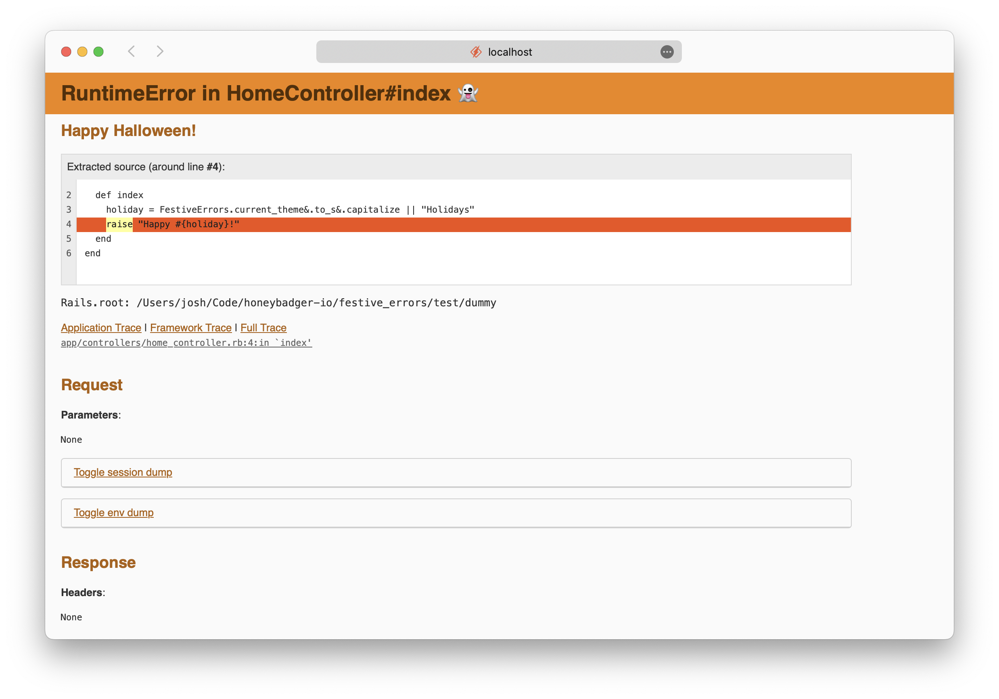

# Festive Errors

[](https://badge.fury.io/rb/festive_errors)

Festive Errors is a Rails gem that spices up the Rails error page with fun holiday themes. We all like to do a little coding around the holidays. Get into the holiday spirit with Festive Errors!


<p align="center"><small><em>Debugging an exception in the month of October.</em></small></p>

## Usage

The gem adds a CSS theme override to the Rails debug page when your app raises an error in development. All you need to do is install it.

## Installation

Add the gem to your Gemfile:

```ruby
bundle add festive_errors --group development
```

## Contributing

This is a new gem. The themes and holidays are limited, and it needs tests. Contributions are welcome!

1. Fork it.
2. Create a topic branch `git checkout -b my_branch`
3. Make your changes and add an entry to [CHANGELOG.md](./CHANGELOG.md).
4. Commit your changes `git commit -am "Happy Hanukkah!"`
5. Push to your branch `git push origin my_branch`
6. Send a [pull request](https://github.com/honeybadger-io/festive_errors/pulls)

## Development

Run the local Rails server in the gem directory to raise a test exception:

```
git clone git@github.com:honeybadger-io/festive_errors.git
cd festive_errors
bundle install
bin/rails server
```

...then visit http://localhost:3000/

## Releasing

1. `gem install gem-release`
2. `gem bump -v [version] -t -r`
3. Update unreleased heading in [CHANGELOG.md](./CHANGELOG.md) (TODO: automate
   this in gem-release command)
4. `git push origin main --tags`

## License

The gem is available as open source under the terms of the [MIT License](https://github.com/honeybadger-io/festive_errors/blob/main/MIT-LICENSE).
